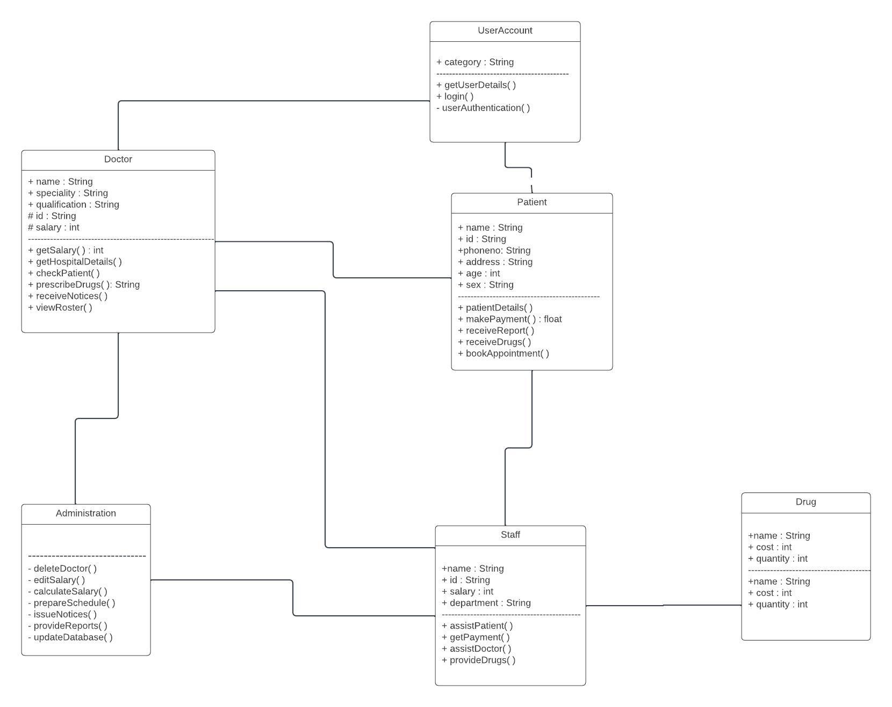

Resource: [Resource Name]
Description: [Brief description of the resource and its purpose in the Hospital Management System]

Attributes:
- [Attribute 1]: [Description of attribute 1]
- [Attribute 2]: [Description of attribute 2]
- ...

API Endpoints:
- [Endpoint 1]: [Description of the endpoint]
- [Endpoint 2]: [Description of the endpoint]
- ...

Data Models:
- [Data Model 1]: [Description of the data model]
- [Data Model 2]: [Description of the data model]
- ...

Dependencies:
- [Dependency 1]: [Description of the dependency]
- [Dependency 2]: [Description of the dependency]
- ...

Instructions for Implementation:
1. [Step-by-step instructions for implementing the resource]
2. [Additional instructions if necessary]
